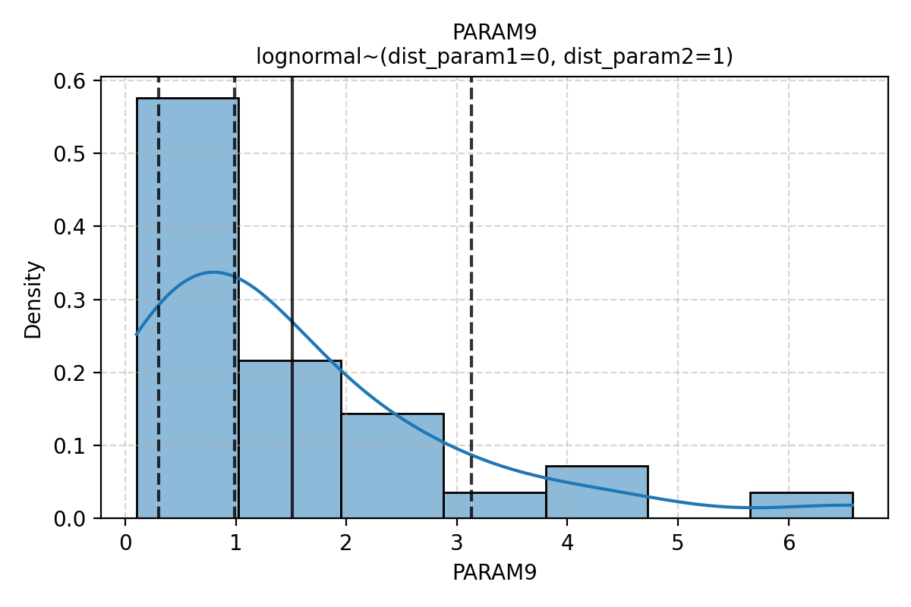
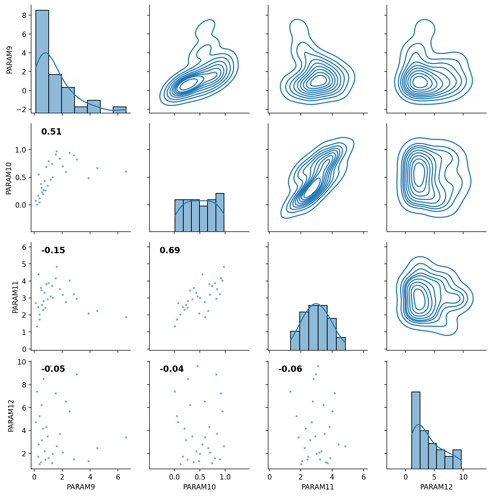

# CHANGELOG

## [2.0.0]

Only the most important changes are described here.
All changes are listed here: https://github.com/equinor/semeio/releases/tag/2.0.0

### Breaking Changes in `fmudesign`

This version of `fmudesign` introduces a few breaking changes as well as new features.

`RandomState` has been replaced with `Generator` which will lead to different but still statistically valid results.
The reasons for this change are:

- `RandomState` is deprecated and in maintenance mode only
- Better performance and statistical properties
- Thread-safe unlike the legacy `RandomState`

Removed support for setting high=low in triangle.

Raises error on duplicate params in defaultvalues sheet.

### QC of distributions in `fmudesign`

- Adds `--verbose` flag, which can be used as `-v` or even `-v -v` in the future.
- When verbose is enabled, QC plots are written to disk and more info is printed.

**Example output:**

```
Added sensitivity : seed
Added sensitivity : faults
Added sensitivity : velmodel
Added sensitivity : contacts
Added sensitivity : multz
================ CONTINUOUS PARAMETERS ================
               mean       std       10%       50%       90%
MULTZ_ILE  0.123196  0.260831  0.000523  0.009097  0.286256
================ GENERATING VARIABLE PLOTS ================
 - Saved file: generateddesignmatrix\multz\MULTZ_ILE.png
Added sensitivity : sens6
================ CONTINUOUS PARAMETERS ================
            mean       std       10%       50%       90%
PARAM5  2.975302  0.910954  1.919026  3.033521  4.054100
PARAM6  0.508785  0.302629  0.180202  0.523022  0.900251
PARAM7  3.090651  0.919048  2.073250  2.958193  4.140698
================ DISCRETE PARAMETERS ================
| FAULT_SEAL   |   proportion |
|:-------------|-------------:|
| 2018-11-03   |          0.4 |
| 2018-11-04   |          0.3 |
| 2018-11-02   |          0.3 |
================ GENERATING VARIABLE PLOTS ================
 - Saved file: generateddesignmatrix\sens6\PARAM5.png
 - Saved file: generateddesignmatrix\sens6\PARAM6.png
 - Saved file: generateddesignmatrix\sens6\PARAM7.png
 - Saved file: generateddesignmatrix\sens6\FAULT_SEAL.png

Warning: Correlation matrix is not consistent
Requirements:
  - Ones on the diagonal
  - Positive semi-definite matrix

Input correlation matrix:
[[1.00 0.90 0.00 0.00]
 [0.90 1.00 0.90 0.00]
 [0.00 0.90 1.00 0.00]
 [0.00 0.00 0.00 1.00]]

Adjusted to nearest consistent correlation matrix:
[[1.00 0.74 0.11 0.00]
 [0.74 1.00 0.74 0.00]
 [0.11 0.74 1.00 0.00]
 [0.00 0.00 0.00 1.00]]

Added sensitivity : sens7
================ CONTINUOUS PARAMETERS ================
             mean       std       10%       50%       90%
PARAM9   1.507389  1.467581  0.298526  0.990224  3.130466
PARAM10  0.500069  0.292213  0.112221  0.494485  0.897666
PARAM11  3.015481  0.835808  2.013407  2.978530  4.039741
PARAM12  3.919238  2.544375  1.331991  3.277196  7.510845
================ CORRELATION_GROUP: ['PARAM9', 'PARAM10', 'PARAM11', 'PARAM12'] ================
Desired correlation:
         PARAM9  PARAM10  PARAM11  PARAM12
PARAM9      1.0      0.9      0.0      0.0
PARAM10     0.9      1.0      0.9      0.0
PARAM11     0.0      0.9      1.0      0.0
PARAM12     0.0      0.0      0.0      1.0
The desired correlation matrix is not valid => corr_rmse=0.10
Closest valid correlation matrix (used as target):
         PARAM9  PARAM10  PARAM11  PARAM12
PARAM9     1.00     0.74     0.11      0.0
PARAM10    0.74     1.00     0.74      0.0
PARAM11    0.11     0.74     1.00      0.0
PARAM12    0.00     0.00     0.00      1.0
Correlation in samples:
         PARAM9  PARAM10  PARAM11  PARAM12
PARAM9     1.00     0.51    -0.15    -0.05
PARAM10    0.51     1.00     0.69    -0.04
PARAM11   -0.15     0.69     1.00    -0.06
PARAM12   -0.05    -0.04    -0.06     1.00
================ GENERATING VARIABLE PLOTS ================
 - Saved file: generateddesignmatrix\sens7\PARAM9.png
 - Saved file: generateddesignmatrix\sens7\PARAM10.png
 - Saved file: generateddesignmatrix\sens7\PARAM11.png
 - Saved file: generateddesignmatrix\sens7\PARAM12.png
 - Saved file: generateddesignmatrix\sens7\PARAM9,PARAM10,PARAM11,PARAM12.png
Added sensitivity : sens8
```





## [1.18.0]

- Moved `fmudesign` from `fmu-tools` to `semeio` and made major improvements to the sampling engine as documentet below.

### Major Improvements in fmudesign's Sampling Engine

This version of `fmudesign` introduces major improvements to its sampling engine:

#### Executive Summary

1. Uses Latin Hypercube sampling instead of standard Monte Carlo sampling to provide more accurate representation of probability distributions with fewer samples. This method also produces more consistent results across repeated sampling runs.
2. Uses the Iman-Conover method to induce correlations while preserving marginal distributions. This approach requires Spearman rank correlations rather than Pearson correlations as inputs, which may be less intuitive for users.
3. Uses an improved algorithm for finding the nearest correlation matrix. Unlike the previous method, which could produce invalid results due to incorrect diagonal values, this new approach guarantees a mathematically valid correlation matrix.

These changes align `fmudesign`'s sampling capabilities more closely with industry-standard tools like Palisade @Risk.

Some more details are now given.

#### Latin Hypercube Sampling

`fmudesign` was originally designed to perform Monte Carlo Sampling (standard random sampling).
It allows users to specify correlations between parameters and uses Cholesky decomposition to induce these correlations.
This is the default approach used by `numpy`'s `multivariate_normal`, and it works well in many applications.
However, Monte Carlo Sampling does not reproduce distributions effectively when few samples are drawn.
In FMU simulations, which are computationally expensive, we need to limit the number of realizations to a minimum.
A standard solution to this limitation is to use Latin Hypercube Sampling (LHS) instead.

The image below shows histograms of 100 samples drawn using MC (left) and LHS (right),
demonstrating that samples drawn using LHS more closely resemble a uniform distribution.


An additional benefit of using LHS with small samples is that resampling produces smaller variations in the sample distribution compared to MC.

Furthermore, we observe more stable convergence of the mean and variance.
The figure below shows the convergence of the mean of a simple non-linear function.
Notice that the LHS version achieves more stable results after approximately 30 samples.


#### Iman-Conover method

While replacing Monte Carlo with LHS addresses one issue, we still face the problem that direct Cholesky decomposition preserves neither marginal distributions nor the properties of sampling methods. @Risk solves this problem by implementing the Iman-Conover method, as described in their technical documentation:
https://www.uio.no/studier/emner/matnat/math/STK4400/v05/undervisningsmateriale/A%20distribution-free%20approach%20to%20rank%20correlation.pdf

We have followed the same approach and implemented our own version of the Iman-Conover method.

The figures below illustrate how the Iman-Conover method preserves marginal distributions while direct Cholesky does not.


#### Nearest correlation matrix

Finally, we need a method to find the nearest correlation matrix to the one specified by users.
This is necessary because manually specifying a correlation matrix that satisfies all required mathematical properties can be challenging.
A valid correlation matrix must be positive semidefinite and have ones on the diagonal.

The current method implemented in fmudesign finds the nearest positive semidefinite matrix but does not constrain the diagonal to be all ones.
We replace this with a method described in the following paper (also implemented in Matlab's nearcorr):
https://ieeexplore.ieee.org/document/8160870

Previous version:

```
Input correlation matrix:
[[1.  0.9 0.  0. ]
 [0.9 1.  0.9 0. ]
 [0.  0.9 1.  0. ]
 [0.  0.  0.  1. ]]
Used closest positive semi-definite correlation matrix:
[[1.068 0.804 0.068 0.   ]
 [0.804 1.136 0.804 0.   ]
 [0.068 0.804 1.068 0.   ]
 [0.    0.    0.    1.   ]]
```

New version:

```
Warning: Correlation matrix is not consistent
Requirements:
  - Ones on the diagonal
  - Positive semi-definite matrix

Input correlation matrix:
[[1.00 0.90 0.00 0.00]
 [0.90 1.00 0.90 0.00]
 [0.00 0.90 1.00 0.00]
 [0.00 0.00 0.00 1.00]]

Adjusted to nearest consistent correlation matrix:
[[1.00 0.74 0.11 0.00]
 [0.74 1.00 0.74 0.00]
 [0.11 0.74 1.00 0.00]
 [0.00 0.00 0.00 1.00]]
```

#### Other changes

- Support for correlating discrete variables has been added
- Excel files produced by fmudesign now include a new sheet that displays the version of semeio used and the creation timestamp
